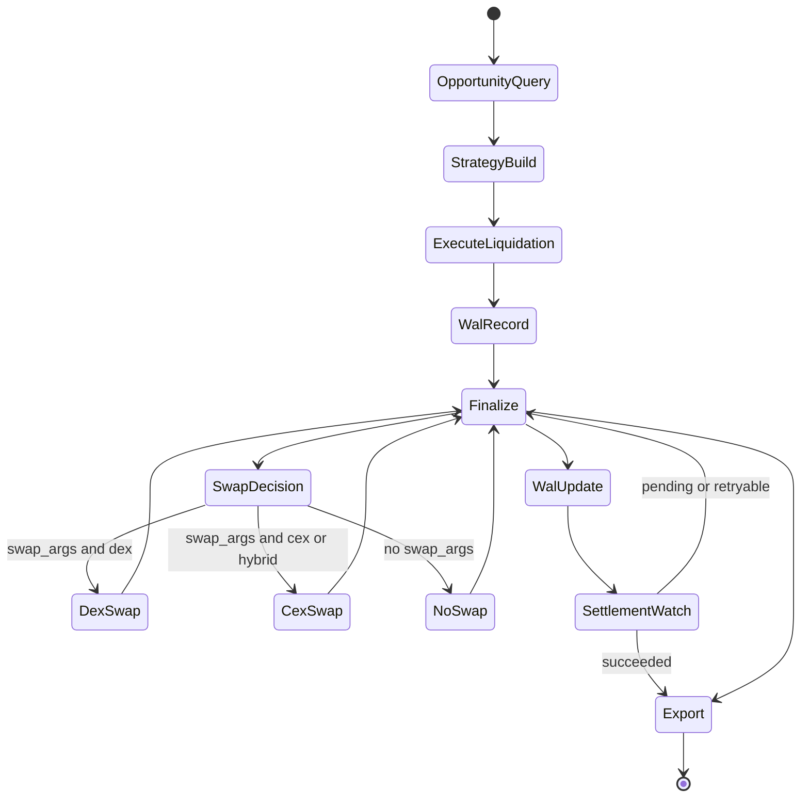

# Liquidator Bot Framework for ICP

A modular, event-driven off-chain liquidation bot framework for [Internet Computer (ICP)](https://internetcomputer.org/) protocols.
Inspired by Artemis/MEV patterns and designed for permissionless, community-driven liquidations.

## Table of Contents

- [Features](#features)
- [At a Glance](#at-a-glance)
- [Quick Install](#quick-install)
- [Configuration](#configuration)
- [Identity Management](#identity-management)
- [Architecture Overview](#architecture-overview)
- [CLI Commands](#cli-commands)
- [Operations Runbook](#operations-runbook)
- [Developer Setup](#developer-setup)
- [Security](#security)
- [Troubleshooting](#troubleshooting)
- [Notes](#notes)
- [License](#license)

---

## Features

- **Pipeline Architecture** — Composable stages for discovery, strategy, execution, finalization, and export.
- **Async Rust** — Highly concurrent and efficient with Tokio runtime.
- **Multi-Chain** — Primary support for ICP with EVM (Arbitrum) integration.
- **Flexible Swaps** — DEX (Kong), CEX (MEXC), or Hybrid strategies.
- **Extensible** — Add custom risk checks, strategies, swaps, or notification stages.
- **Permissionless** — Anyone can run it.
- **Multi-Account** — Separate liquidator, trader, and recovery identities for security.
- **CLI Interface** — Manage balances, funds, and identities.
- **Persistent State** — SQLite WAL ensures no double-liquidations and supports retries.

## At a Glance

- **Best first run:** use `SWAPPER=dex` until CEX credentials are configured.
- **Current config precedence:** shell env vars > local `.env` > `~/.liquidium-pipeline/config.env`.
- **Required env vars (minimum):** `MNEMONIC_FILE`, `IC_URL`, `EVM_RPC_URL`, `LENDING_CANISTER`, `DEBT_ASSETS`, `COLLATERAL_ASSETS`.
- **Primary operations:** `liquidator run`, `liquidator balance`, `liquidator withdraw`, `liquidator account show`.
- **Persistence:** SQLite WAL (`DB_PATH`) enables idempotent retries and resume-safe execution.

---

## Quick Install

```bash
curl -fsSL https://raw.githubusercontent.com/Liquidium-Inc/liquidium-pipeline/main/install.sh | bash
```

This will:

- Clone/update the repo to `~/.liquidium-pipeline/repo`
- Build the liquidator binary in release mode
- Install it to `~/.local/bin/liquidator`
- Create `~/.liquidium-pipeline/config.env` if it doesn't exist (won't overwrite an existing file)

> Set `SKIP_RUST=true` before running to skip Rust installation if already present.

### Install Script Behavior (No Surprises)

- User-only install (no sudo) that keeps everything under `~/.liquidium-pipeline`
- Releases are stored in `~/.liquidium-pipeline/releases` and symlinked to `~/.local/bin/liquidator`
- Re-running the script updates the repo + binary, but **does not overwrite** your existing `config.env`
- You can customize with env/args: `BRANCH`, `BIN_NAME`, `INSTALL_DIR`, `SKIP_RUST`

### Upgrade and Compatibility

- Re-running the install command is the recommended upgrade path.
- `config.env` is preserved across upgrades; new config keys should be added manually when needed.
- Legacy alias `CEX_BUY_INVERSE_OVESPEND_BPS` remains accepted, while `CEX_BUY_INVERSE_OVERSPEND_BPS` is canonical.

---

## Configuration

The bot loads configuration from (in order of precedence):

1. Environment variables (direct overrides)
2. `.env` in the current directory (optional overrides)
3. `~/.liquidium-pipeline/config.env` (user-level defaults)

### Override Rules (How Env "Overwrites" Work)

- Variables already set in your shell **always win**.
- `.env` overrides `~/.liquidium-pipeline/config.env`.
- `~/.liquidium-pipeline/config.env` is the default baseline created by the install script.

**One-off override example:**

```bash
IC_URL=https://icp-api.io liquidator run
```

### Required Configuration

```bash
# ICP Blockchain
IC_URL=https://ic0.app
LENDING_CANISTER=nja4y-2yaaa-aaaae-qddxa-cai

# EVM Blockchain
EVM_RPC_URL=https://arb1.arbitrum.io/rpc

# Identity
MNEMONIC_FILE=~/.liquidium-pipeline/wallets/key

# Assets (comma-separated principal:symbol pairs)
DEBT_ASSETS=principal1:ckBTC,principal2:ckUSDT,principal3:ICP
COLLATERAL_ASSETS=principal1:ckBTC,principal2:ckUSDT,principal3:ICP

# Optional: only scan specific borrower principals (comma-separated). Set to "none" to disable.
OPPORTUNITY_ACCOUNT_FILTER=principal1,principal2
```

### Optional Configuration

```bash
# Optional operation flags
BUY_BAD_DEBT=false
DB_PATH=./wal.db
EXPORT_PATH=executions.csv
WATCHDOG_WEBHOOK=https://your-webhook-url.com/endpoint
```

### Swap Configuration

```bash
# Swap strategy: dex | cex | hybrid
SWAPPER=hybrid

# DEX (Kong)
MAX_ALLOWED_DEX_SLIPPAGE=75  # 0.75% in basis points

# CEX (MEXC) - Optional
CEX_MEXC_API_KEY=your_api_key
CEX_MEXC_API_SECRET=your_api_secret
MAX_ALLOWED_CEX_SLIPPAGE_BPS=200  # 2.00% in basis points
```

### Advanced CEX/Hybrid Tuning

```bash
# CEX trade slicing and execution controls
# Skip execution chunks below this USD notional (treat as dust)
CEX_MIN_EXEC_USD=2.0
# Per-slice impact target ratio of MAX_ALLOWED_CEX_SLIPPAGE_BPS
CEX_SLICE_TARGET_RATIO=0.7
# Arm adaptive buy fallback when truncation ratio is >= this value
CEX_BUY_TRUNCATION_TRIGGER_RATIO=0.25
# Max quote overspend allowed for inverse/base buy fallback (bps)
CEX_BUY_INVERSE_OVERSPEND_BPS=10
# Max inverse/base fallback retries per trade leg
CEX_BUY_INVERSE_MAX_RETRIES=1
# Enable/disable adaptive inverse/base fallback
CEX_BUY_INVERSE_ENABLED=true
# Retry backoff base and cap (seconds) for retryable CEX errors
CEX_RETRY_BASE_SECS=5
CEX_RETRY_MAX_SECS=120
# Minimum projected net edge required before executing on CEX (bps)
CEX_MIN_NET_EDGE_BPS=150
# Additional latency-risk haircut applied to projected edge (bps)
CEX_DELAY_BUFFER_BPS=75
# Estimated route fee haircut applied to projected edge (bps)
CEX_ROUTE_FEE_BPS=25
# Hybrid shortcut: force CEX above this notional (USD), set 0 to disable
CEX_FORCE_OVER_USD_THRESHOLD=12.5
```

Quick reference:

| Parameter | What it controls |
|----------|-------------------|
| `CEX_MIN_EXEC_USD` | Dust floor per slice (below this, execution is skipped). |
| `CEX_SLICE_TARGET_RATIO` | How aggressive slice sizing is vs hard slippage cap. |
| `CEX_BUY_TRUNCATION_TRIGGER_RATIO` | When buy truncation is considered large enough to trigger fallback logic. |
| `CEX_BUY_INVERSE_OVERSPEND_BPS` | Safety cap for how much inverse/base buy mode may overspend. |
| `CEX_BUY_INVERSE_MAX_RETRIES` | Max fallback attempts per leg. |
| `CEX_BUY_INVERSE_ENABLED` | Master toggle for adaptive buy fallback. |
| `CEX_RETRY_BASE_SECS` | Initial retry delay after retryable CEX errors. |
| `CEX_RETRY_MAX_SECS` | Maximum retry delay cap. |
| `CEX_MIN_NET_EDGE_BPS` | Minimum projected edge needed before choosing CEX path. |
| `CEX_DELAY_BUFFER_BPS` | Extra haircut for execution-latency/price-move risk. |
| `CEX_ROUTE_FEE_BPS` | Fee haircut applied during route edge estimation. |
| `CEX_FORCE_OVER_USD_THRESHOLD` | In hybrid mode, force CEX above this USD notional (`0` disables). |

Note: `CEX_BUY_INVERSE_OVESPEND_BPS` is still accepted as a legacy alias, but `CEX_BUY_INVERSE_OVERSPEND_BPS` is the canonical key.

#### `CEX_SLICE_TARGET_RATIO` Explained

`CEX_SLICE_TARGET_RATIO` controls how aggressive each CEX execution slice is.

The slicer computes:

`target_slice_bps = MAX_ALLOWED_CEX_SLIPPAGE_BPS * CEX_SLICE_TARGET_RATIO`

With:
- `MAX_ALLOWED_CEX_SLIPPAGE_BPS=200`
- `CEX_SLICE_TARGET_RATIO=0.7`

Target per slice becomes `140 bps`.

Meaning:
- Higher ratio (`0.9`) -> larger slices, fewer orders, more impact risk.
- Lower ratio (`0.4`) -> smaller slices, more orders, lower impact risk.

Important:
- This is a **sizing target**, not the hard reject limit.
- Hard rejection still uses `MAX_ALLOWED_CEX_SLIPPAGE_BPS`.

Examples when `MAX_ALLOWED_CEX_SLIPPAGE_BPS=200`:
- `CEX_SLICE_TARGET_RATIO=0.5` -> target `100 bps`
- `CEX_SLICE_TARGET_RATIO=0.7` -> target `140 bps`
- `CEX_SLICE_TARGET_RATIO=1.0` -> target `200 bps`

#### Impact Risk (What Can Still Go Wrong)

Even with slicing, execution still has market-impact and timing risk:

- **Book movement risk**: preview uses current orderbook, but fills happen slightly later.
- **Depth cliff risk**: one more level consumed can sharply worsen average price.
- **Thin-book risk**: soft target may find no chunk; only hard-cap fallback may be possible.
- **Precision/truncation risk**: exchange step-size and min-notional rules can reduce consumed size.
- **Retry drift risk**: after a retry, liquidity and prices may be different.

How config controls this risk:

- `MAX_ALLOWED_CEX_SLIPPAGE_BPS`: hard per-slice reject limit (safety brake).
- `CEX_SLICE_TARGET_RATIO`: softer sizing target below hard limit (execution smoothness).
- `CEX_MIN_EXEC_USD`: prevents low-notional micro-fills that usually have poor quality.
- `CEX_BUY_*`: controls adaptive buy fallback when quote-mode truncation leaves meaningful residual.

#### Execution Algorithm (Per Trade Leg)

For each leg, the finalizer runs a resumable slice loop:

1. Compute target slice impact:
   `target_slice_bps = MAX_ALLOWED_CEX_SLIPPAGE_BPS * CEX_SLICE_TARGET_RATIO`
2. Fetch orderbook for the leg market.
3. Estimate the largest chunk under `target_slice_bps` using binary search on simulated impact.
4. If no positive chunk passes soft target, try one-shot fallback:
   full remaining amount is accepted only if fillable and under the hard cap.
5. If chunk notional is below `CEX_MIN_EXEC_USD`, mark as dust and stop this leg.
6. Submit one market slice with deterministic `client_order_id` (WAL-safe resume/idempotency).
7. Use **actual** exchange fill amounts (`input_consumed`, `output_received`) for math.
8. Compute realized execution price and slippage:
   - sell: `exec_price = output_received / input_consumed`
   - buy: `exec_price = input_consumed / output_received`
   - sell slippage bps: `max(0, (preview_mid - exec_price) / preview_mid * 10000)`
   - buy slippage bps: `max(0, (exec_price - preview_mid) / preview_mid * 10000)`
9. If realized slippage > `MAX_ALLOWED_CEX_SLIPPAGE_BPS`, fail fast.
10. Otherwise, persist progress (`remaining_in`, `total_out`) and continue until consumed/dust.
11. On buy legs only, if truncation ratio is large and residual is executable, arm one inverse/base fallback retry (bounded by `CEX_BUY_INVERSE_MAX_RETRIES`).

Route summary metrics are updated from slice notional, and weighted slippage is tracked for post-trade reporting.

**Supported swappers:**

- **DEX (Kong)** — `SWAPPER=dex` (uses built-in Kong backend defaults)
- **CEX (MEXC)** — `SWAPPER=cex` (requires MEXC API credentials)
- **Hybrid** — `SWAPPER=hybrid` (tries DEX first, falls back to CEX)

### Storage & Export

```bash
DB_PATH=./wal.db
EXPORT_PATH=executions.csv
BUY_BAD_DEBT=false  # Set to true to liquidate even if not profitable
```

### Monitoring

```bash
WATCHDOG_WEBHOOK=https://your-webhook-url.com/endpoint
```

> `WATCHDOG_WEBHOOK`: if set, the bot sends POST requests with JSON payloads for monitoring and alerting (for example: Slack, Discord, or custom services).

---

## Identity Management

The bot uses **three identities** derived from a BIP39 mnemonic for security:

| Identity | Purpose | Description |
|----------|---------|-------------|
| **Liquidator** | Main account | Initiates liquidations, receives collateral |
| **Trader** | Swap execution | Isolated swap operations (reduces MEV risk) |
| **Recovery** | Fallback | Catches failed collateral transfers |

### Generate New Identities

```bash
liquidator account new
```

Creates new Ed25519/Secp256k1 identities for all three roles.

### Show Existing Identities

```bash
liquidator account show
```

Displays a table of all identities with their principals and statuses.

---

## Architecture Overview

### Crate Structure

```
liquidium-pipeline/
├── core/        # Chain-agnostic types, tokens, balance service, RAY math
├── connectors/  # ICP/EVM backends, key derivation, canister calls
├── pipeline/    # Main app - stages, executors, finalizers, CLI
└── commons/     # Shared utilities and error types
```

### Pipeline Stages



| Stage | Description |
|-------|-------------|
| **Opportunity Discovery** | Polls lending canister for at-risk positions |
| **Strategy Filter** | Filters opportunities by profitability and supported assets |
| **Liquidation Execution** | Calls `liquidate()` on lending canister, seizes collateral |
| **Swap Finalization** | Swaps collateral via DEX/CEX/Hybrid strategy |
| **Export / Reporting** | Saves execution details to CSV |

Stages are implemented with `async-trait` for composability.

### Swap Strategies

| Strategy | Description |
|----------|-------------|
| **DEX** | Swaps via Kong on ICP. Retries with increasing slippage (0.75% → 5%). |
| **CEX** | Deposits to MEXC, swaps, and withdraws. |
| **Hybrid** | Tries DEX first, falls back to CEX on failure. |

### Retry & State Management

- **SQLite WAL** tracks liquidation state across restarts
- **Retryable failures** retry up to 5 times with exponential backoff
- **Idempotent operations** prevent double-liquidations

---

## CLI Commands

### Run the Liquidation Loop

```bash
liquidator run
# optional: custom control socket
liquidator run --sock-path /run/liquidator/ctl.sock
# optional: enable file sink at default path
liquidator run --log-file
# optional: enable file sink at custom path
liquidator run --log-file ./liquidator.log
# optional: explicitly disable file sink
liquidator run --no-log-file
```

Starts the foreground daemon loop (systemd-supervised) that continuously monitors and executes liquidations.
The control socket accepts `pause` / `resume` from attachable clients.
By default, `liquidator run` does not write a local log file.
Passing `--log-file` (without a value) enables file logging at the default path:
`<temp>/liquidator/liquidator.log` (for example, `/tmp/liquidator/liquidator.log` on Linux).
Passing `--log-file /custom/path.log` writes to that custom file.
`--log-file` and `--no-log-file` are mutually exclusive.

Default control socket path:
- Linux: `/run/liquidator/ctl.sock`
- non-Linux: `<temp>/liquidator/ctl.sock`

### Start the TUI

```bash
liquidator tui
# optional: custom socket/unit/file source
liquidator tui --sock-path /run/liquidator/ctl.sock --unit-name liquidator.service --log-file /path/to/log
```

Launches an attachable terminal UI to **pause/resume** the daemon, view **WAL status**, **profits** (from `EXPORT_PATH`), **balances**, and run **withdrawals** (ICP tokens only).
Log source selection:
- If `--log-file` is provided, TUI tails that file on any OS.
- If running on Linux with no `--log-file`, TUI prefers `journalctl -u <unit-name>` (default unit: `liquidator.service`).
- If that unit is inactive on Linux, TUI may auto-tail `<temp>/liquidator/liquidator.log` if the file exists and was updated recently.
- On non-Linux systems without `--log-file`, TUI tails `<temp>/liquidator/liquidator.log` if present, otherwise it shows a no-log-source notice.

**Key bindings:**
- `r` — pause/resume
- `b` — refresh balances
- `p` — refresh profits
- `w` — withdraw (from balances)
- `d` — MEXC deposit address (from balances); in Withdraw panel, refresh deposit info
- `tab` — switch views
- `q` — quit

### Check Balances

```bash
liquidator balance
```

Displays **main**, **trader**, and **recovery** balances. Recovery balances are marked as "seized collateral (stale, pending withdrawal if swaps failed)".

### Withdraw Funds

#### Interactive Wizard

```bash
liquidator withdraw
```

Launches an interactive wizard to select source account, asset, amount, and destination.

#### Non-Interactive (Flags)

```bash
liquidator withdraw \
  --source main \
  --destination <main|trader|recovery|ACCOUNT> \
  --asset <ASSET_SYMBOL|all> \
  --amount <DECIMAL|all>
```

**Options:**
- `--source`: `main`, `trader`, or `recovery`
- `--destination`: `main`, `trader`, `recovery`, or target ICP account/principal
- `--asset`: Asset symbol (e.g., `ckBTC`, `ckUSDT`, `ICP`) or `all`
- `--amount`: Specific amount or `all` for full balance

**Example:**
```bash
liquidator withdraw --source main --destination abc123-xyz --asset ckUSDT --amount all
```

---

## Operations Runbook

1. Verify account wiring and credentials:

   ```bash
   liquidator account show
   liquidator balance
   ```

2. Start with conservative routing while validating setup:

   ```bash
   SWAPPER=dex liquidator run
   ```

3. Enable monitoring and inspect output artifacts:

   - Configure `WATCHDOG_WEBHOOK` for alerts.
   - Check CSV exports at `EXPORT_PATH` and WAL state at `DB_PATH`.

4. Move funds operationally when needed:

   ```bash
   liquidator withdraw --source main --destination <main|trader|recovery|ACCOUNT> --asset <ASSET_SYMBOL|all> --amount <DECIMAL|all>
   ```

---

## Developer Setup

```bash
# Clone the repository
git clone https://github.com/Liquidium-Inc/liquidium-pipeline.git
cd liquidium-pipeline

# Build in release mode
cargo build --release

# Binary location
./target/release/liquidator
```

### Run Tests

```bash
cargo test
```

### Environment Logging

Set `RUST_LOG` for debug output:

```bash
RUST_LOG=debug liquidator run
```

For Grafana/Loki-friendly logs (no ASCII tables/spinner/banner), build with the `plain-logs` feature:

```bash
cargo build --release -p liquidium-pipeline --features plain-logs
RUST_LOG=info ./target/release/liquidator run
```

In `plain-logs` builds, interactive withdraw prompts are disabled; use non-interactive `liquidator withdraw --source ... --destination ... --asset ... --amount ...` flags.

### Daemon + systemd Example

Use the sample unit at `dev/liquidator.service`:

```ini
[Service]
RuntimeDirectory=liquidator
RuntimeDirectoryMode=0770
ExecStart=/usr/local/bin/liquidator run --sock-path /run/liquidator/ctl.sock
Restart=always
```

Validate daemon logs:

```bash
journalctl -u liquidator.service -f -o short
```

Attach the TUI at any time:

```bash
liquidator tui --sock-path /run/liquidator/ctl.sock --unit-name liquidator.service
```

Convenience installer for Linux:

```bash
./dev/install-daemon.sh
```

This installs/updates `/etc/systemd/system/liquidator.service`, creates the
`liquidator` user/group if missing, runs `systemctl daemon-reload`, enables the
unit, and restarts it.

Linux non-service mode with file tail:

```bash
liquidator run --log-file
liquidator tui
```

On macOS/dev, use file fallback explicitly:

```bash
liquidator run --log-file ./liquidator.log
liquidator tui --log-file ./liquidator.log
```

---

## Security

- Treat `MNEMONIC_FILE`, `CEX_MEXC_API_KEY`, and `CEX_MEXC_API_SECRET` as secrets; never commit them.
- Restrict CEX API keys to required permissions only, and rotate keys periodically.
- Keep mnemonic backups offline and access controlled.
- Prefer separate runtime users/environments for production bot instances.

## Troubleshooting

- `LENDING_CANISTER not configured` / `EVM_RPC_URL not configured`: confirm required env vars are set in `.env` or `config.env`.
- `Invalid source account` / destination parse errors during withdraw: use `main|trader|recovery` aliases or valid account/principal text.
- CEX calls failing in `hybrid`/`cex` mode: verify `CEX_MEXC_API_KEY` and `CEX_MEXC_API_SECRET`.
- Noisy terminal output in containerized logging stacks: build and run with `--features plain-logs`.
- Missing diagnostic detail: rerun with `RUST_LOG=debug`.
- Runtime socket permission mismatch under systemd: run `systemctl daemon-reload` and restart `liquidator.service`; ensure `RuntimeDirectory=liquidator` and `RuntimeDirectoryMode=0770` are set on the active unit.
- `liquidator run` exits immediately saying systemd unit is already active: this is intentional duplicate-daemon protection; stop the unit first or use `liquidator tui` to attach.

## Notes

- Works with ICRC-1/ICRC-2 assets (ckBTC, ckUSDT, ICP, etc.)
- Identity/config can be system-wide or project-local
- Composable stages allow for custom liquidation strategies
- EVM support enables cross-chain liquidations (Arbitrum)

> Tip: use interactive wizards for manual operations and CLI flags for automation (cron jobs, scripts).

---

## License

MIT
